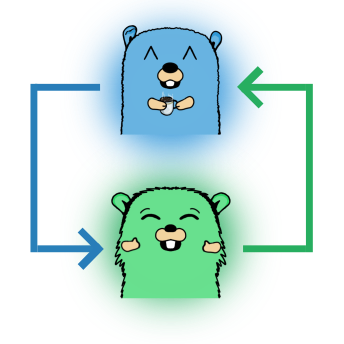

    

<h1 align="center">ScreenShare/server</h1>

<i>screen sharing for developers</i>

     
    
    

## Intro

In the past I've had some problems sharing my screen with coworkers using
corporate chatting solutions like Microsoft Teams. I wanted to show them some
of my code, but either the stream lagged several seconds behind or the quality
was so poor that my colleagues couldn't read the code. Or both.

That's why I created ScreenShare. It allows you to share your screen with good
quality and low latency. ScreenShare is an addition to existing software and 
only helps to share your screen. Nothing else (:.

## Features

* Multi User Screenshare
* Secure transfer via WebRTC
* Low latency / High resolution
* Simple Install via Docker / single binary
* Integrated TURN Server see [NAT Traversal](https://ScreenShare.net/#/nat-traversal)

[Demo / Public Instance](https://app.ScreenShare.net/) ᛫ [Installation](https://ScreenShare.net/#/install) ᛫ [Configuration](https://ScreenShare.net/#/config) 

## Versioning

We use [SemVer](http://semver.org/) for versioning. For the versions available, see the
[tags on this repository](https://github.com/ScreenShare/server/tags).
